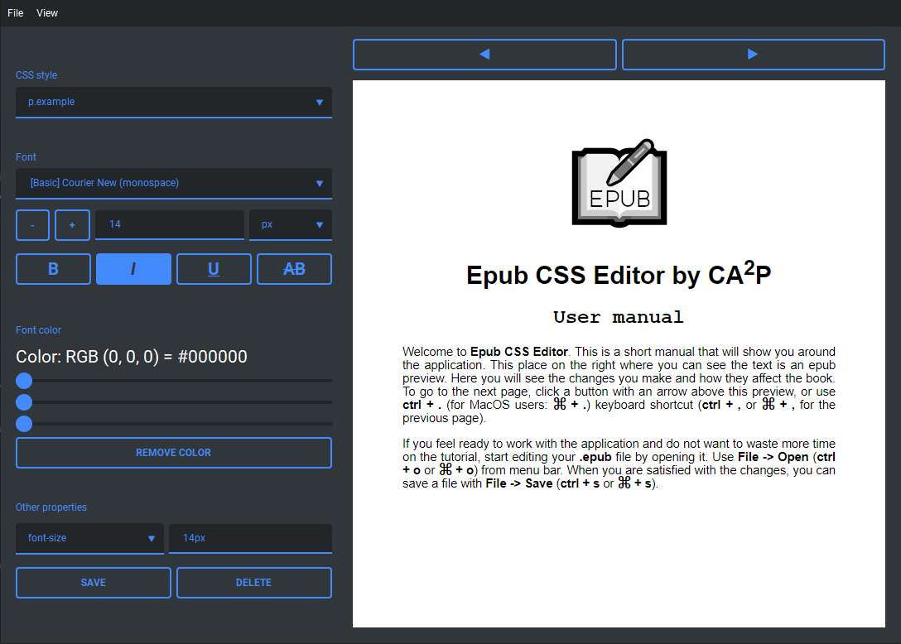
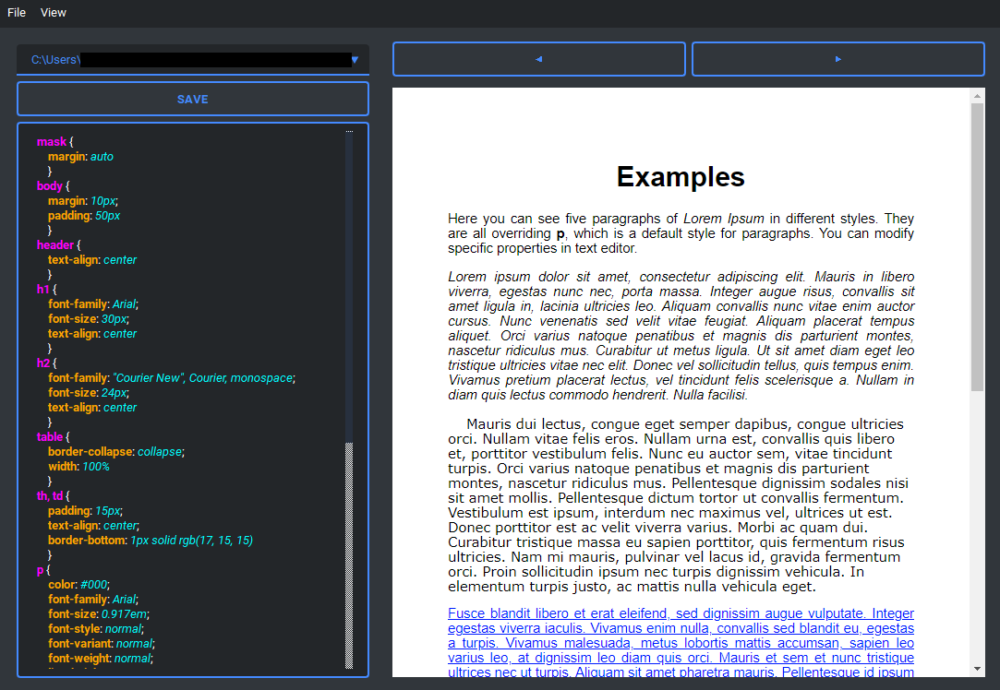

# EPUB CSS Editor

## Description
A simple window application for editing CSS files inside EPUB packages. The app consists of two screens, one being a simple graphical interface and the other a text-based CSS file editor.

It also allows to import and embed custom fonts into EPUB files (however with no obfuscating) and comes with a few open-license fonts. 

The app was created as a school project. It is not perfect and we plan no support for it in the future.

## Authors (CA2P team)
- Aleksander Garlikowski
- Przemysław Pąk
- Cezary Moczulski
- Aleksandra Piekarzewicz

## Graphical editor:

## Text editor:

# Installation

## Windows / Linux
Run "main.exe" (Windows) or "main" (Linux) executable from main folder in their respective archive.

## MacOS / Directly from code

1. Download and install Python 3.9 and pip
2. Use "pip install" to install all dependencies listed below.
3. Download this repository and run "python main.py" in its top folder

### Dependencies
- pyside6 (6.2.0)
- shiboken6 (6.2.0)
- Jinja2 (3.0.1)
- MarkupSafe (2.0.1)
- qt-material (2.8.13)
- cssutils (2.3.0)
- lxml (4.6.3)

# License
The program and its code are distribued under GNU General Public License v3.0, that can be found here: [https://choosealicense.com/licenses/gpl-3.0/](https://choosealicense.com/licenses/gpl-3.0/)